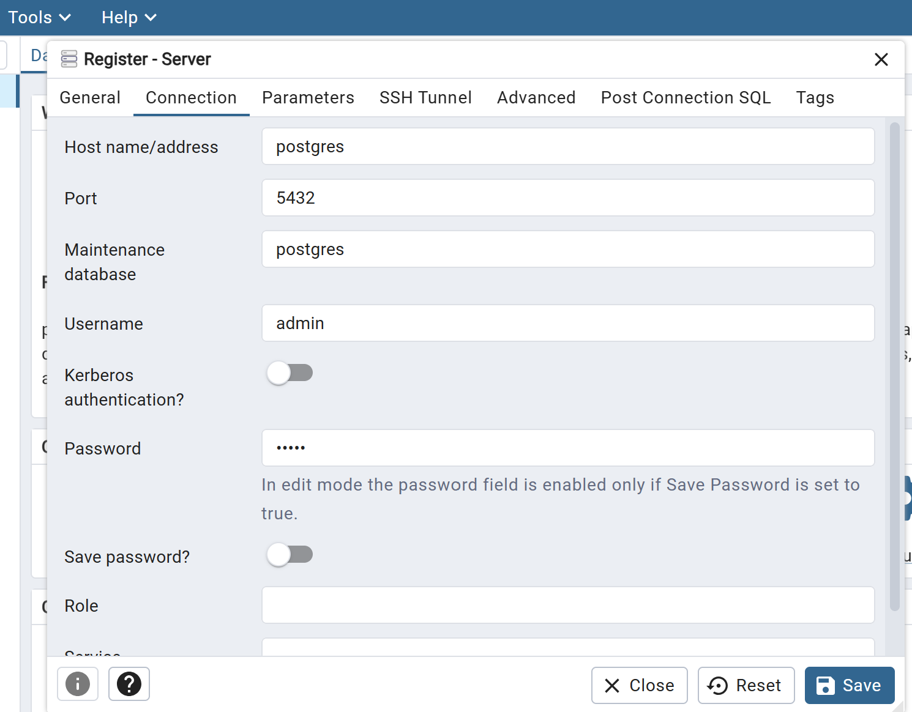
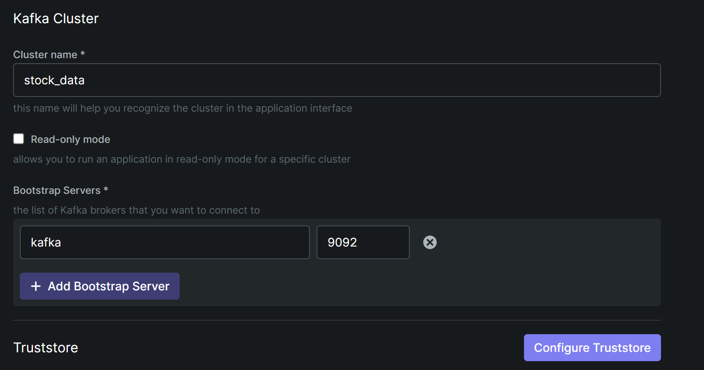
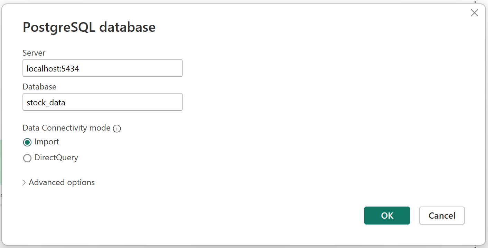

## Project Name: Real Time Stock Market Analysis

 The project implements a real-time data pipeline that extracts stock data from an API, streams it through Apache Kafka, processes it with Apache Spark, and loads it into a postgres database. 
 
 All components are containerized with Docker for easy deployment.

 [**Data Source** ](https://rapidapi.com/alphavantage/api/alpha-vantage/playground/apiendpoint_55220bb2-8a64-4cde-89e1-87ec00947f57)

 ### Data Pipeline Architecture
 

 ### Business Understanding

 MarketPulse Analytics is a financial services firm based in New York City, specializing in real-time stock market analysis, financial forecasting, and trading strategy optimization. 

 ### Business Challenge
 - **Customer Demand For More Insights:** Clients are demanding more advanced analytics, such as predictive stock price movements, sentiment analysis, and portfolio performance optimization.

 - **Scalability:** As the volume of data grows, the existing infrastructure struggles to scale efficiently. This results in delays in delivering real-time insights to clients, particularly during periods of high market activity (e.g., market opening and closing hours, earnings reports).

 - **Data Latency:** The current system has occasional latency issues, especially when integrating data from multiple sources (e.g., stock exchanges, news feeds, and social media sentiment analysis). This affects the accuracy of the reports generated, which can harm client satisfaction and decision-making.


 ### Project Objectives
 - **Develop A Scalable Real-Time Data Pipeline:** Implement a fault-tolerant, and scalable data pipeline using Kafka to stream stock market data from multiple exchanges, ensuring low latency and high availability.

 - **Enhance Data Accuracy And Timeliness:** Reduce latency and improve the accuracy of real-time data reports by streamlining the data processing workflow.

 - **Build a Visualization Report:** Develop a report using Power BI to visualize market trends, stock performance, and other financial metrics in real time.
  
 ### Project Deliverable
 The goal of this project is to ensure that MarketPulse Analytics is able to serve and meet its customers demand for updated stock market information while ensuring that it can stay ahead in the industry amid the industry competition 
 
 ### Project Stack
  - `API → Produces JSON events into Kafka.`
  - `Kafka / Kafka UI → Inspect topics/messages.`
  - `Spark → Consumes and process data from Kafka, writes to Postgres.`
  - `Postgres → Stores results for analytics.`
  - `pgAdmin → Manage Postgres visually.`
  - `Power BI → External (connects to Postgres database).`

 ## Project Setup
 ### Clone The Repository
  ```bash
    # Clone the repository
    git clone https://github.com/ioaviator/Real-Time-Stock-Market-Analysis.git

    # Navigate to project directory
    cd Real-Time-Stock-Market-Analysis
  ```

  ### Setup Environment Variables
  ```bash
    # Create a .env file in project root directory

    ## get your API key from the api data source mentioned above
    API_KEY=ADD API KEY
    POSTGRES_USER=admin
    POSTGRES_PASSWORD=admin
    PGADMIN_DEFAULT_EMAIL=sample@admin.com
    PGADMIN_DEFAULT_PASSWORD=admin
  ```

  ### Create And Activate The Virtual Environment
  ```bash
    python -m venv venv
    source venv/Scripts/activate
  ```

  ### Install Project Dependencies
  ```bash
    pip install -r requirements.txt
  ```

  ### Run The Docker Services
  ```bash
    docker compose up -d
  ```

  ### Connect To The Postgresql Database Server From Pgadmin
  ### Connect To Kafka Server From The Kafka Client 
  ```bash
    ## pgadmin: Create your database and tables with the client: (dbname: stock_data, db_table:stocks)
    localhost:5050

    ## kafka-ui 
    localhost:8085
  ```
  <br>

  ### Postgres Login From Pgadmin
  
  
  ### Kafka Login From Kafka UI
  

  ### Run The Python Producer Script To Send Data To Kafka
  ```bash
    python producer/main.py

    ## Login to the kafka ui client to see the messages pushed to kafka: ( topic name - stock_analysis )
  ```

  ### Inspect The Consumer Script: Read Data From Kafka And Load To Postgres
  ```bash
    ## Login to Docker Desktop, locate the name of the project container, expand it and click on the consumer service  (Inspect the logs). This is now sending data to your postgres database

    ## Login to the pgadmin client and check the messages now streamed into the (stock_data:stocks) database table. 
    ## You need to run the `SELECT * FROM Table` query
  ```

  ### Connect Power BI To Postgres
  


  ### Shut Down Server
  ```bash
    docker compose down -v
  ```

  ### Further Additions
  - Observability and Monitoring of system pipelines
  - Data Processing using Kafka Streams 